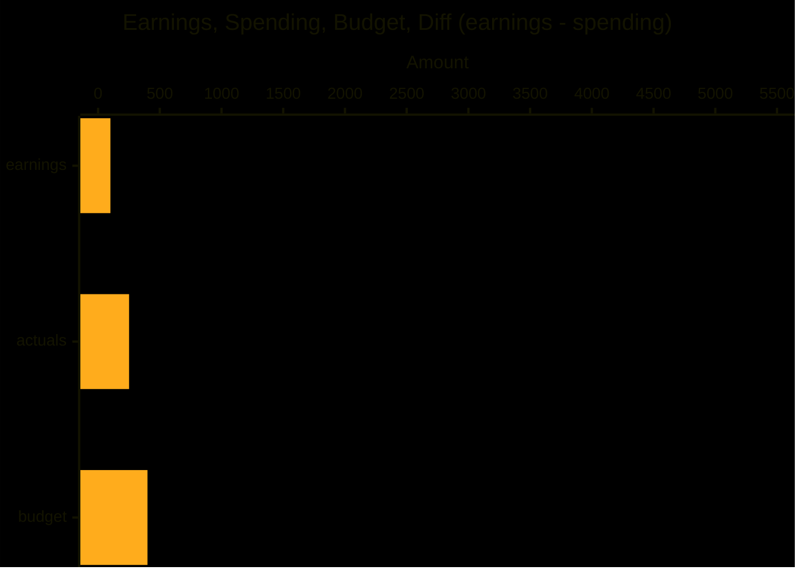
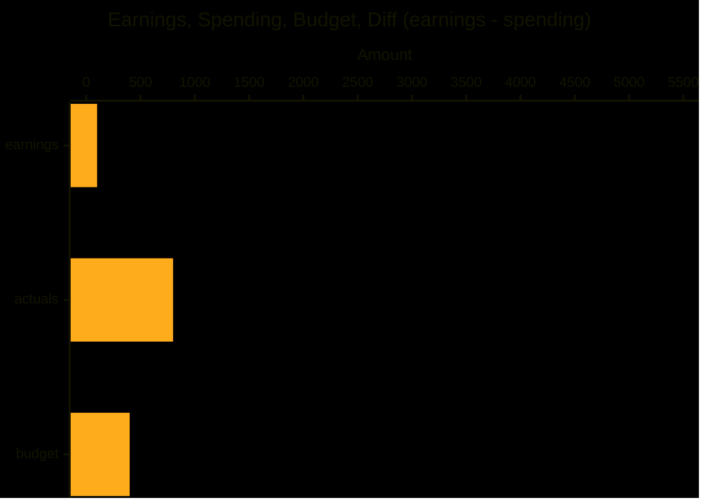
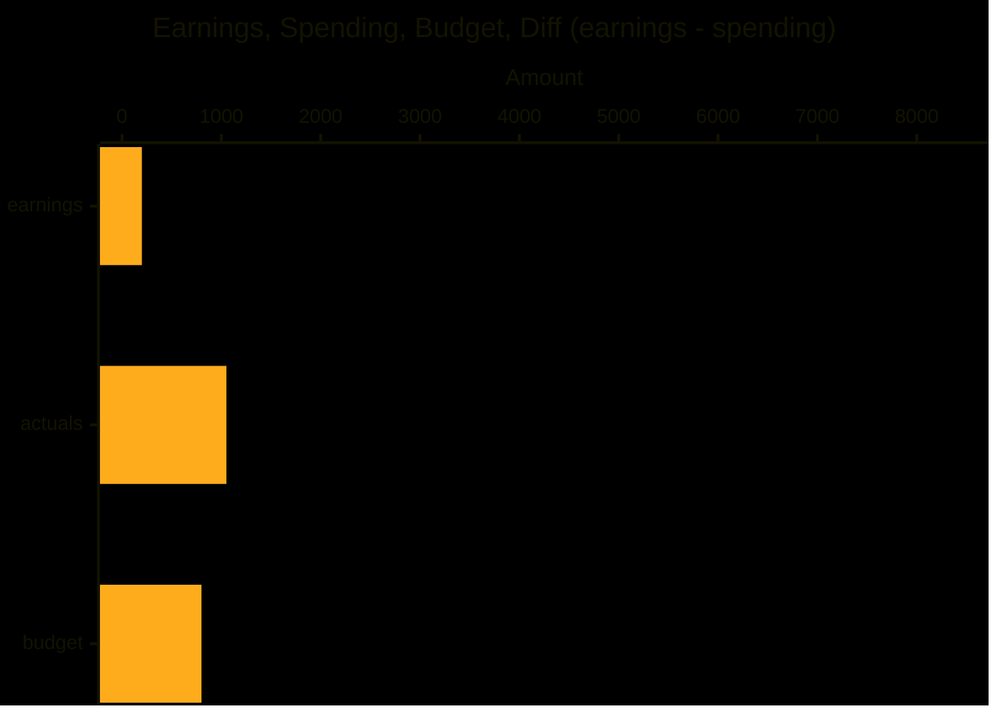
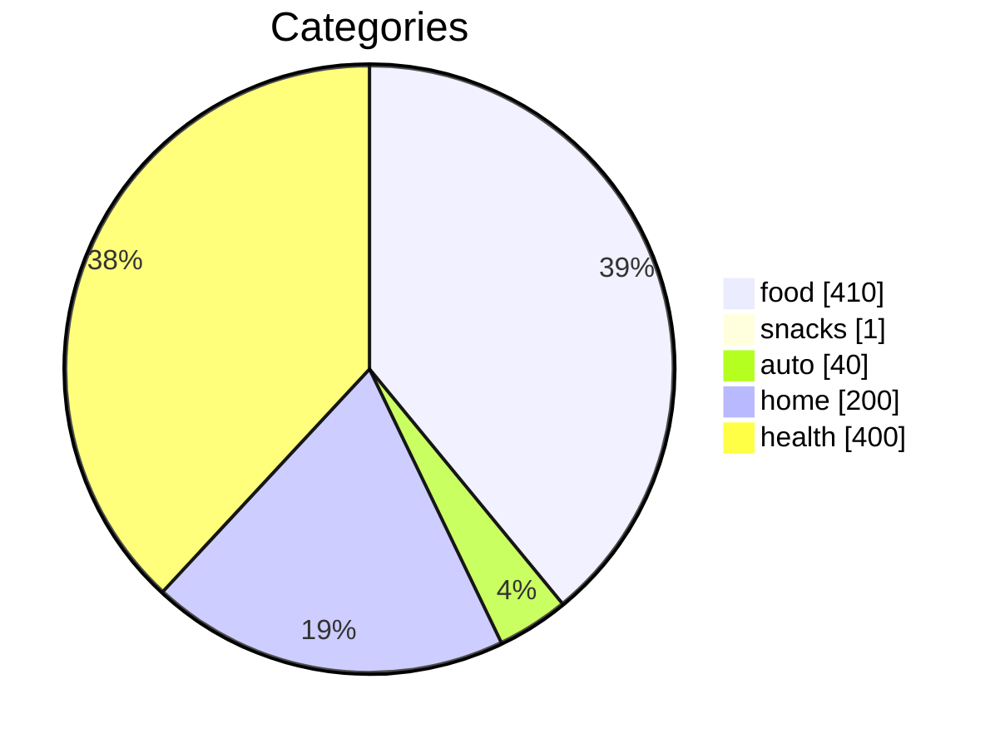

# Budget 2024-07

| date_range | earnings | actuals | budget |
|------------|----------|---------|--------|
| 02         | 100.00   | 251.00  | 400.00 |
| 01         | 100.00   | 800.00  | 400.00 |
| month      | 200.00   | 1051.00 | 800.00 |

### Half 01

### Half 02

### Month

## Categories

| category | budget | actuals | diff    |
|----------|--------|---------|---------|
| food     | 0.00   | 410.00  | -410.00 |
| snacks   | 0.00   | 1.00    | -1.00   |
| auto     | 0.00   | 40.00   | -40.00  |
| home     | 0.00   | 200.00  | -200.00 |
| health   | 0.00   | 400.00  | -400.00 |

### Budget

```mermaid
--- 
config: 
   themeVariables:
      xyChart: 
         backgroundColor: "#000"
         plotColorPalette: "#ffac1c, #097969"
---
xychart-beta
    title "Budget vs. Spending"
    y-axis "Amount" 0 --> 3000
    x-axis [food, snacks, auto, home, health]
    bar [0.00, 0.00, 0.00, 0.00, 0.00]
    bar [410.00, 1.00, 40.00, 200.00, 400.00]
```

