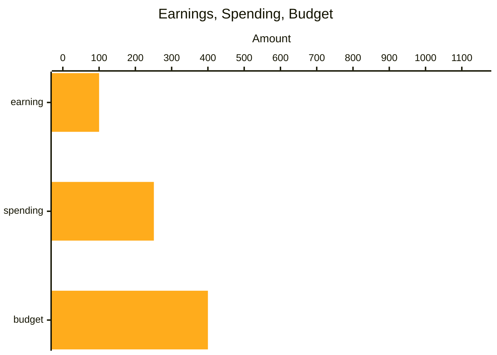
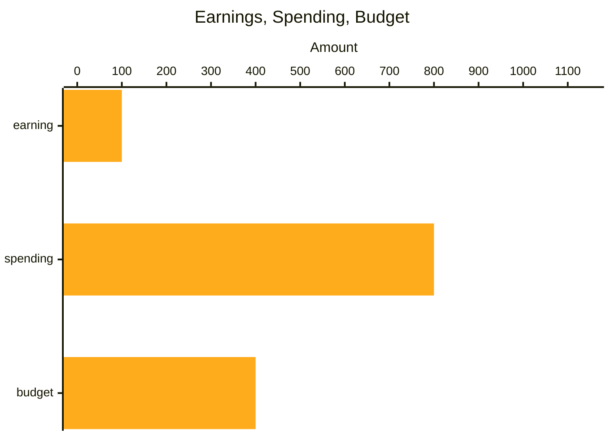
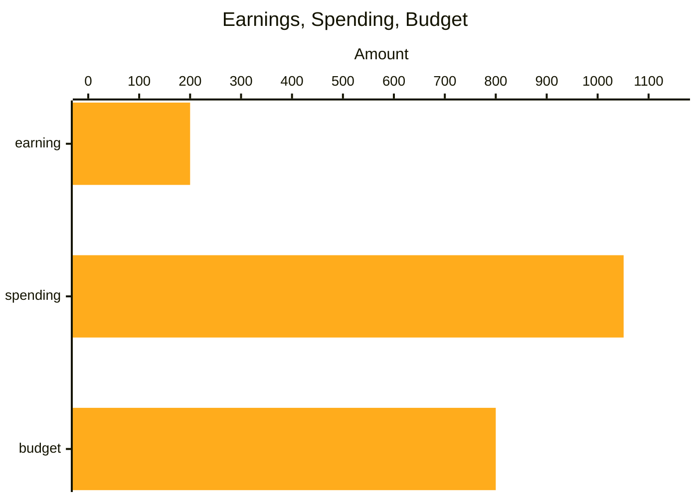

# Budget 2024-07

| date_range | earning | spending | budget |
|------------|---------|----------|--------|
| 02         | 100.00  | 251.00   | 400.00 |
| 01         | 100.00  | 800.00   | 400.00 |
| month      | 200.00  | 1051.00  | 800.00 |
---

 ### Half 01

### Half 02

### Month

## Categories

| category | budget | spending |
|----------|--------|----------|
| food     | 400.00 | 410.00   |
| snacks   | 0.00   | 1.00     |
| auto     | 400.00 | 40.00    |
| home     | 0.00   | 200.00   |
| health   | 0.00   | 400.00   |
| work     | 0.00   | 0.00     |
---

### Budget

```mermaid
--- 
config: 
   themeVariables:
      xyChart: 
         plotColorPalette: "#ffac1c, #097969"
---
xychart-beta
    title "Budget vs. Spending"
    y-axis "Amount" 0 --> 510.00
    x-axis [food, snacks, auto, home, health, work]
    bar [400.00, 0.00, 400.00, 0.00, 0.00, 0.00]
    bar [410.00, 1.00, 40.00, 200.00, 400.00, 0.00]
```

